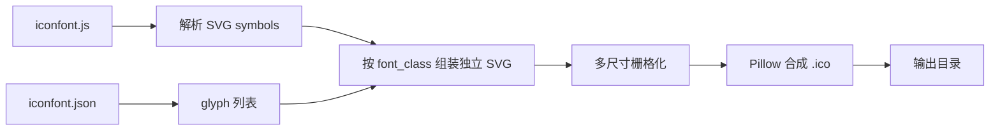
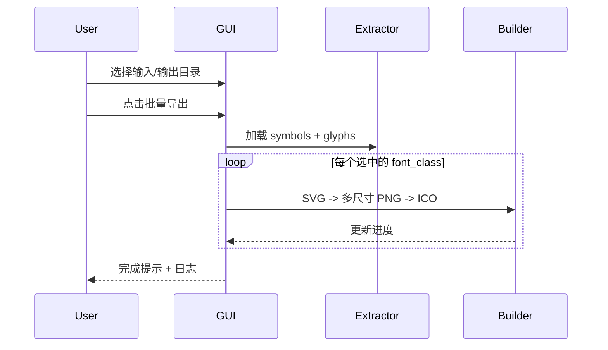

# Iconfont 批量转 PyInstaller .ico 应用

## 背景与输入格式

仓库当前仅有 iconfont 导出资源，无应用代码：

| 文件 | 作用 |
|------|------|
| [ai_icon/font_6xww5b6c7bv/iconfont.js](ai_icon/font_6xww5b6c7bv/iconfont.js) | 单行 JS，变量 `window._iconfont_svg_string_` 内嵌完整 `<svg><symbol id="icon-xxx">...</symbol>...</svg>` |
| [ai_icon/font_6xww5b6c7bv/iconfont.json](ai_icon/font_6xww5b6c7bv/iconfont.json) | 28 个 glyph 元数据，`font_class` 对应 symbol 的 `id="icon-{font_class}"` |

注意：`iconfont.css` 引用的 `iconfont.ttf` **不在仓库中**，因此必须以 **SVG symbol** 为唯一矢量源，不能走字体渲染。



## PyInstaller 对 .ico 的要求（设计约束）

- 格式必须是真正的 **ICO**（多图块容器），不能只是把 `.png` 改扩展名。
- 建议内嵌尺寸：**16, 32, 48, 256**（Windows 10+ 资源管理器与任务栏依赖 256；小尺寸用于列表/快捷方式）。
- 每个尺寸应 **独立渲染**（从矢量直接出图），避免仅从 256 缩小导致细线发糊。

## 技术方案

### 核心依赖

| 库 | 用途 |
|----|------|
| **Pillow** | 多尺寸 PNG 合成为单文件 `.ico` |
| **PyMuPDF (`fitz`)** | 在 Windows 上将 SVG 栅格化为位图（`pip` 有预编译 wheel，比 cairosvg 少系统级 Cairo 依赖） |

### 模块划分（新建 `src/` 包）

1. **`icon_extractor.py`**
   - 从 `iconfont.js` 用定界符提取 `_iconfont_svg_string_` 内容（`'` 包裹的单行字符串）。
   - 用 `xml.etree.ElementTree` 解析 `<symbol>`，建立 `icon-{font_class} -> {viewBox, inner SVG}` 字典。
   - 根据 `iconfont.json` 的 `glyphs` 生成独立 SVG 文档：

```xml
<svg xmlns="http://www.w3.org/2000/svg" viewBox="0 0 1024 1024" width="256" height="256">
  <!-- symbol 内 path 等子节点 -->
</svg>
```

   - 若某 `font_class` 在 JS 中无对应 symbol，记录警告并跳过。

2. **`ico_builder.py`**
   - `render_svg_to_png(svg_bytes, size) -> Image`：PyMuPDF 打开 SVG stream，`get_pixmap` 按目标像素缩放。
   - `build_ico(images_by_size, path)`：Pillow `save(..., format="ICO", sizes=[...])` 写入多分辨率。
   - 默认尺寸列表：`[16, 32, 48, 256]`（GUI 可勾选/预设，默认全开）。

3. **`gui.py`**（主入口，`python -m src` 或 `python src/gui.py`）
   - **tkinter** 实现（标准库，后续若用 PyInstaller 打包本工具也简单）。
   - 界面区域：
     - **输入目录**：默认 `ai_icon/font_6xww5b6c7bv`，可浏览选择（需同时存在 `iconfont.js` + `iconfont.json`）。
     - **输出目录**：批量 `.ico` 目标文件夹。
     - **图标列表**：28 项，默认全选；支持全选/反选；单击可在右侧 **预览**（256px 渲染图）。
     - **背景色**：白底 / 透明（透明在部分 Windows 缩略图下可能发灰，默认白底更稳妥）。
     - **尺寸选项**：16/32/48/256 复选框。
     - **导出按钮** + **进度条** + **日志文本框**（成功/跳过/失败明细）。
   - 批量导出命名：`{font_class}.ico`（保留 `edit-tools` 等连字符；非法文件名字符替换为 `_`）。

4. **项目根文件**
   - [requirements.txt](requirements.txt)：`Pillow>=10.0.0`, `PyMuPDF>=1.23.0`
   - [README.md](README.md)：使用说明、PyInstaller 引用示例 `--icon=app.ico`、依赖安装

### GUI 交互流程



## 目录结构（拟新增）

```
src/
  __init__.py
  __main__.py          # python -m src 启动 GUI
  icon_extractor.py
  ico_builder.py
  gui.py
requirements.txt
README.md
```

不修改现有 [ai_icon](ai_icon) 资源文件；应用通过路径读取。

## 验证方式（实现后）

1. `pip install -r requirements.txt`
2. 运行 GUI，输入指向 `ai_icon/font_6xww5b6c7bv`，输出到 `output_icons/`
3. 确认生成 **28 个** `.ico`，每个用资源管理器查看多尺寸缩略图正常
4. 任选其一测试 PyInstaller：`pyinstaller --onefile --icon=output_icons/app.ico your_script.py`（无需真打包，可用 `--dry-run` 或仅检查 PyInstaller 不报错接受图标路径）

## 风险与应对

| 风险 | 应对 |
|------|------|
| `iconfont.js` 体积大、单行解析失败 | 定界符截取 + ET 解析；失败时在 GUI 日志给出明确错误 |
| 部分 symbol 含复杂 SVG 特性 | iconfont 符号通常为 `<path>`，PyMuPDF 足够；异常 glyph 单独记录并继续批量 |
| 透明底在 exe 图标上显示异常 | GUI 默认白底，可切换透明 |

## 不在本次范围

- 不打包/发布 PyInstaller 版转换器本身（可在 README 留可选说明）
- 不下载缺失的 `iconfont.ttf`
- 不做单图标模式（你已选批量；若以后要加，可在同一 GUI 加「仅导出选中」按钮，改动很小）
